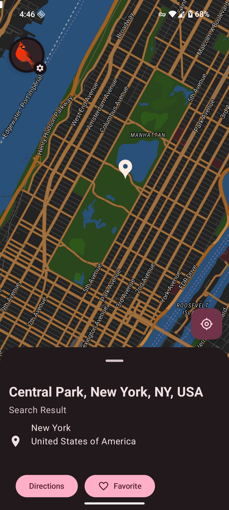
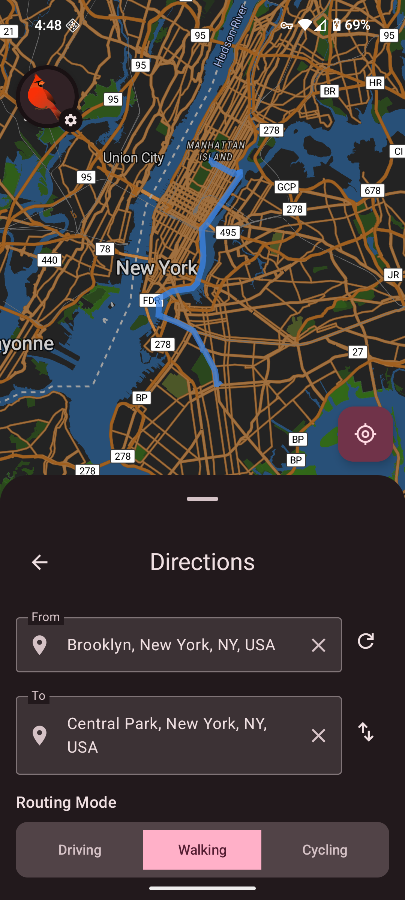

<a href="https://apps.obtainium.imranr.dev/redirect?r=obtainium://app/%7B%22id%22%3A%22earth.maps.cardinal%22%2C%22url%22%3A%22https%3A%2F%2Fgithub.com%2Fellenhp%2Fcardinal%22%2C%22author%22%3A%22ellenhp%22%2C%22name%22%3A%22Cardinal%22%2C%22preferredApkIndex%22%3A0%2C%22additionalSettings%22%3A%22%7B%5C%22includePrereleases%5C%22%3Afalse%2C%5C%22fallbackToOlderReleases%5C%22%3Atrue%2C%5C%22filterReleaseTitlesByRegEx%5C%22%3A%5C%22%5C%22%2C%5C%22filterReleaseNotesByRegEx%5C%22%3A%5C%22%5C%22%2C%5C%22verifyLatestTag%5C%22%3Afalse%2C%5C%22sortMethodChoice%5C%22%3A%5C%22date%5C%22%2C%5C%22useLatestAssetDateAsReleaseDate%5C%22%3Afalse%2C%5C%22releaseTitleAsVersion%5C%22%3Afalse%2C%5C%22trackOnly%5C%22%3Afalse%2C%5C%22versionExtractionRegEx%5C%22%3A%5C%22%5C%22%2C%5C%22matchGroupToUse%5C%22%3A%5C%22%5C%22%2C%5C%22versionDetection%5C%22%3Afalse%2C%5C%22releaseDateAsVersion%5C%22%3Afalse%2C%5C%22useVersionCodeAsOSVersion%5C%22%3Afalse%2C%5C%22apkFilterRegEx%5C%22%3A%5C%22%5C%22%2C%5C%22invertAPKFilter%5C%22%3Afalse%2C%5C%22autoApkFilterByArch%5C%22%3Atrue%2C%5C%22appName%5C%22%3A%5C%22%5C%22%2C%5C%22appAuthor%5C%22%3A%5C%22%5C%22%2C%5C%22shizukuPretendToBeGooglePlay%5C%22%3Afalse%2C%5C%22allowInsecure%5C%22%3Afalse%2C%5C%22exemptFromBackgroundUpdates%5C%22%3Afalse%2C%5C%22skipUpdateNotifications%5C%22%3Afalse%2C%5C%22about%5C%22%3A%5C%22%5C%22%2C%5C%22refreshBeforeDownload%5C%22%3Afalse%7D%22%2C%22overrideSource%22%3Anull%7D" class="img-badge">
    
</a>

# Cardinal Maps

Cardinal Maps is a mapping application for Android designed to get out of your way and be there when you need it. We believe maps should be fast, private, and focused on what matters most—helping you navigate the world around you.

## User-Focused Design

Every decision we make puts the user first:
- **No ads** - Clean interface without distractions
- **No tracking or analytics** - Your data stays yours
- **Offline mode** - Navigate even when you need maximum privacy
- **Snappy performance** - Optimized for quick loading and smooth interaction

## Screenshots

## Key Features

- **Online and offline modes** - Search and get directions anywhere in the world out of the box, with complete offline privacy just a few taps away.
- **Self-host your maps services** - Works seamlessly with [Headway](https://github.com/headwaymaps/headway) for those who want the convenience of online maps on their own terms.
- **Modern look and feel** - Built from the ground up in Material 3.
- **Built with industry-standard tools** - Contributors aren't bogged down with years of legacy C++ cruft.

## Feature Comparison

Below is a comparison of Cardinal Maps with other open-source mapping applications:

| Feature | Cardinal Maps | OsmAnd | Organic Maps/CoMaps |
|---------|---------------|--------|--------------|
| **Privacy** | Full-featured offline mode available, and users are able to point online geocoding and routing requests to whichever backend they feel comfortable with in Advanced Settings, **including self-hosted services** like [Headway](https://github.com/headwaymaps/headway). | OsmAnd operates completely offline, meaning the only data that leaves your device is which areas of the world you download maps for. | Similar to OsmAnd, CoMaps is completely offline except for the map download step. |
| **Offline Maps** | Users can pre-download maps for areas of the world they live in or want to visit. The user can pick which areas to download, from a small neighborhood to a metropolitan area. | The user can choose which pre-defined map packs they want to download. | Similar to OsmAnd, map packs are pre-defined. |
| **User Interface** | Uses platform-native UI toolkits (Material 3 on Android) and industry-standard map rendering tech ([MapLibre Native](https://github.com/maplibre/maplibre-native)) for a modern look and feel. | Written almost entirely in Java with bespoke map rendering | Written almost entirely in C++ with bespoke UI and map rendering |
| **Navigation** | Full support using [Ferrostar](https://github.com/stadiamaps/ferrostar) for a sleek experience online and offline. | Full support | Full support |
| **Performance** | Subjectively, quite good. Map pans and flings are smooth. | Choppy at times. | Choppy at times. |

## Support the project

Cardinal maps is a labor of love with, currently, one committer. If you've been looking for something better in the FOSS maps space for years like me, and see the vision of Cardinal Maps, your support would mean the world. Anything from a small sponsorship on [GitHub Sponsors](https://github.com/sponsors/ellenhp) or [Liberapay](https://liberapay.com/ellenhp) to bug reports and pull requests help. Even starring the project is enough to give me a little dopamine hit and keep me motivated to continue work. 

## Contributing

If you'd like to help out we welcome contributions from the community! Please see our [Contributing Guidelines](CONTRIBUTING.md) for more information. Cardinal Maps is written in Rust and Kotlin and based on industry standard maps tooling, so feature work is rewarding and developer friction is low.

## License

This project is licensed under the Apache License, version 2.0—see the [LICENSE](LICENSE) file for details.

## Contact

For questions, suggestions, or support, please open an issue on our GitHub repository.
