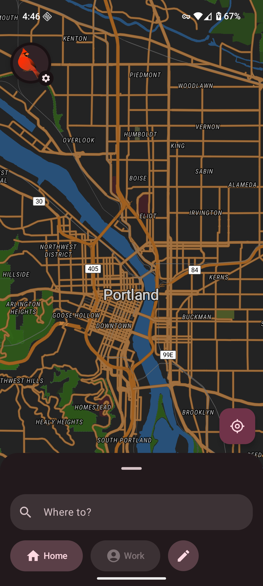

# Cardinal Maps

Cardinal Maps is a mapping application for Android designed to get out of your way and be there when you need it. We believe maps should be fast, private, and focused on what matters most--helping you navigate the world around you.

## User-Focused Design

Every decision we make puts the user first:
- **No ads** - Clean interface without distractions
- **No tracking or analytics** - Your data stays yours
- **Offline mode** - Navigate even when you need maximum privacy
- **Snappy performance** - Optimized for quick loading and smooth interaction

## Screenshots

  

## Feature Comparison

Below is a comparison of Cardinal Maps with other open-source mapping applications:

| Feature | Cardinal Maps | OsmAnd | CoMaps |
|---------|---------------|--------|--------------|
| **Privacy** | Full-featured offline mode available, and users are able to point online geocoding and routing requests to whichever backend they feel comfortable with in Advanced Settings, **including self-hosted services** like [Headway](https://github.com/headwaymaps/headway). | OsmAnd operates completely offline, meaning the only data that leaves your device is which areas of the world you download maps for. | Similar to OsmAnd, CoMaps is completely offline except for the map download step. |
| **Offline Maps** | Users can pre-download maps for areas of the world they live in or want to visit. The user can pick which areas to download, from a small neighborhood to a metropolitan area. | The user can choose which pre-defined map packs they want to download. | Similar to OsmAnd, map packs are pre-defined. |
| **User Interface** | Uses platform-native UI toolkits (Material 3 on Android) and industry-standard map rendering tech ([MapLibre Native](https://github.com/maplibre/maplibre-native)) for a modern look and feel. | Written almost entirely in Java with bespoke map rendering | Written almost entirely in C++ with bespoke UI and map rendering |
| **Navigation** | Full support using [Ferrostar](https://github.com/stadiamaps/ferrostar) for a sleek experience online and offline. | Full support | Full support |
| **Performance** | Subjectively, quite good. Map pans and flings are smooth. | Choppy at times. | Choppy at times. |

## Contributing

We welcome contributions from the community! Please see our [Contributing Guidelines](CONTRIBUTING.md) for more information. Cardinal Maps is written in Rust and Kotlin and based on industry standard maps tooling, so feature work is rewarding and the pace of development is high.

## License

This project is licensed under the Apache License, version 2.0—see the [LICENSE](LICENSE) file for details.

## Contact

For questions, suggestions, or support, please open an issue on our GitHub repository.
